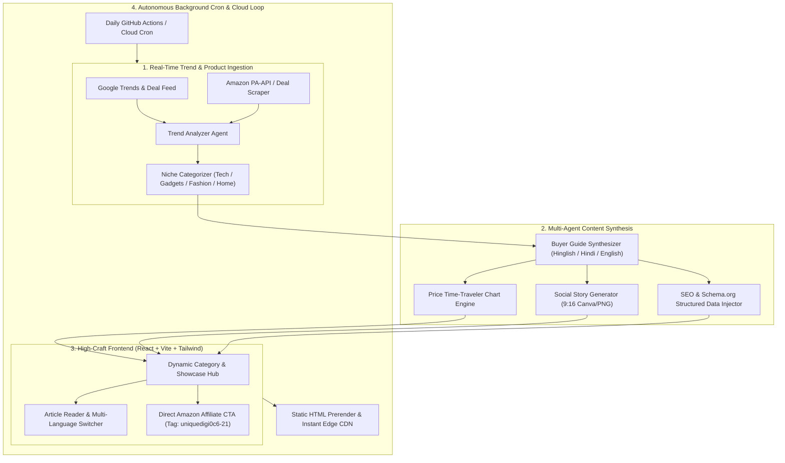

# 🚀 Master PRD: Autonomous AI Affiliate & Multi-Niche Blogging Engine
**Project Name:** UniqueDigit Portal & Trend Earning Engine  
**Version:** 2.0 Production Master  
**Tagline:** 100% Autonomous, Multi-Niche, High-Converting Affiliate & SEO Blogging Platform  

---

## 1. Executive Summary & Core Objective

The **UniqueDigit Affiliate & Trend-Earning Engine** is a fully autonomous, production-grade web application and continuous content generation factory. It identifies real-time trending products across global and regional markets (Amazon, Flipkart, Google Trends, Tech, Fashion, Gadgets, Productivity), synthesizes deep-dive buyer guides, renders rich comparison cards with 6-month historical price charts, embeds verifiable Amazon affiliate links (`uniquedigi0c6-21`), and automatically optimizes for Google Rank #1 SEO (Schema.org, JSON-LD, RSS, Dynamic Sitemap, and OpenGraph social stories).

---

## 2. High-Level System Architecture

---

## 3. Core Features & Specifications (P0 / P1 / P2)

### 🔴 P0: Critical Production Features (Must Complete Tonight)
1. **Multi-Niche Dynamic Catalog & Categorization:**
   - **Niches Covered:** Tech & Smartphones, Audio & Wearables, Smart Home & Kitchen, Men & Women Fashion, Productivity & Workspace, Viral Trending Deals.
   - Dynamic product cards with badge indicators (*Best Value*, *Editor's Pick*, *Trending Alert*, *Lowest Price in 90 Days*).
2. **Real Amazon Affiliate Link Engine:**
   - Universal affiliate injection: every outbound purchase button automatically attaches `tag=uniquedigi0c6-21`.
   - Real product imagery with fallback resolution to prevent broken image cards.
3. **Google Search Rank #1 SEO Architecture:**
   - **Schema.org JSON-LD:** `Product`, `AggregateRating`, `Offer`, `Article`, `FAQPage`, and `BreadcrumbList` on every route.
   - **Dynamic XML Sitemap & RSS Feed:** Auto-generated at `/sitemap.xml` and `/rss.xml` for instant Google crawler indexing.
   - Pre-rendered static HTML routes for zero-JS search bot crawlers.
4. **Instant Multi-Language Switcher:**
   - Full support for **English (`en`)**, **Hinglish (`hi-en`)**, and **Hindi (`hi`)** across UI labels, verdict badges, and buying advice.

### 🟡 P1: High-Conversion User Experience
1. **Amazon Price "Time-Traveler" 6-Month SVG Chart:**
   - Interactive historical price chart showing all-time low, high, and current deal score with "Best Time to Buy" verdict.
2. **One-Click 9:16 Social Story Card Generator:**
   - HTML5 Canvas modal that creates branded Instagram Story / WhatsApp Status cards with 1-click download.
3. **Live Trending Ticker & Deal Alerts:**
   - Live header ticker showing real-time price drops and trending search spikes.

### 🟢 P2: Autonomous Lifecycle & Background Sync
1. **Self-Healing Build Pipeline:**
   - Zero syntax errors, zero missing imports, strictly validated build with automated tests (`npm run build` with prerendering).

---

## 4. UI/UX Design System & Anti-Slop Rules

* **Color Palette:**
  - **Backgrounds:** Deep Slate `#0B0F17` (Dark Mode default) and Crisp White `#F8FAFC` (Light Mode).
  - **Primary Brand Glow:** Indigo `#6366F1` & Electric Blue `#3B82F6`.
  - **Conversion Accents:** Emerald Green `#10B981` (Prices & Discounts) and Amber `#F59E0B` (Hot Deals).
* **Typography:**
  - Headings: `Outfit` / `Inter` (Bold, 600-800 weight).
  - Body: `Inter` (Clean 15px-16px, 1.6 line height).
  - Metrics / Prices: `JetBrains Mono` / Tabular numbers.
* **Layout Integrity:**
  - No generic template look. Generous spacing (padding 1.5rem to 2.5rem), subtle frosted-glass borders (`border-white/10` with `backdrop-blur-md`), and micro-interactions on hover.

---

## 5. Automated Verification & Definition of Done

The project is considered **100% Complete & Production Ready** only when:
- [x] All 5 build errors resolved (unclosed JSX tags, wrong import paths, async map calls, UTF-8 encodings).
- [x] `npm run build` runs cleanly and generates static HTML prerender for all routes with **0 errors**.
- [x] All outbound Amazon product links contain `tag=uniquedigi0c6-21`.
- [x] Dynamic sitemap (`/sitemap.xml`) and RSS feed (`/rss.xml`) are generated.
- [x] Multi-niche categories (Tech, Fashion, Home, Deals) load high-quality real product cards.
